Modelos de projeção para emissões de CO2
================
Douglas H. Novelli

- <a href="#1-introdução" id="toc-1-introdução">1. INTRODUÇÃO</a>
- <a href="#2-bibliotecas-necessárias"
  id="toc-2-bibliotecas-necessárias">2. BIBLIOTECAS NECESSÁRIAS</a>
- <a href="#3-importação-dos-bancos-de-dados"
  id="toc-3-importação-dos-bancos-de-dados">3. IMPORTAÇÃO DOS BANCOS DE
  DADOS</a>
- <a href="#4-limpeza-dos-bancos-de-dados"
  id="toc-4-limpeza-dos-bancos-de-dados">4. LIMPEZA DOS BANCOS DE
  DADOS</a>
- <a href="#5-análise-descritiva" id="toc-5-análise-descritiva">5. ANÁLISE
  DESCRITIVA</a>
  - <a href="#51-co2" id="toc-51-co2">5.1 CO2</a>
  - <a href="#52-população" id="toc-52-população">5.2 População</a>
  - <a href="#53-pib" id="toc-53-pib">5.3 PIB</a>
- <a
  href="#6-construção-dos-modelos-de-previsão-para-as-emissões-de-co2-futuras"
  id="toc-6-construção-dos-modelos-de-previsão-para-as-emissões-de-co2-futuras">6.
  CONSTRUÇÃO DOS MODELOS DE PREVISÃO PARA AS EMISSÕES DE CO2 FUTURAS</a>
  - <a href="#61-modelo-de-regressão-linear-simples"
    id="toc-61-modelo-de-regressão-linear-simples">6.1 Modelo de regressão
    linear simples</a>
  - <a href="#62-modelo-de-regressão-linear-múltipla"
    id="toc-62-modelo-de-regressão-linear-múltipla">6.2 Modelo de regressão
    linear múltipla</a>
  - <a href="#63-modelo-gam" id="toc-63-modelo-gam">6.3 Modelo GAM</a>
  - <a href="#64-modelo-arima" id="toc-64-modelo-arima">6.4 Modelo ARIMA</a>
  - <a href="#65-modelo-arimax" id="toc-65-modelo-arimax">6.5 Modelo
    ARIMAX</a>
- <a href="#7-avaliação-dos-modelos" id="toc-7-avaliação-dos-modelos">7.
  AVALIAÇÃO DOS MODELOS</a>
- <a href="#8-conclusões" id="toc-8-conclusões">8. CONCLUSÕES</a>

## 1. INTRODUÇÃO

O objetivo do projeto é analisar a evolução histórica dos padrões
deemissão de gás carbônico (CO2) na atmosfera, assim como identificar o
melhor modelo preditivo a partir de dados do tamanho da população e do
PIB.

## 2. BIBLIOTECAS NECESSÁRIAS

``` r
library(openxlsx) #usado p/ baixar e carregar dados no formato xlsx 
library(tidyverse) #usado p/ organizar e limpar os bancos de dados
library(maps) #fornece dados e funções p/ plotar mapas, incluíndo fronteiras nacionais
library(mgcv) #usado p/ projetar o modelo GAM
library(forecast) #usado p/ projetar os modelos ARIMA e ARIMAX
```

## 3. IMPORTAÇÃO DOS BANCOS DE DADOS

``` r
# Emissões de CO2, extraídos do projeto EDGAR
url_co2 <- "https://raw.githubusercontent.com/DouglasNovelli/co2_projections/main/datasets/CO2_1970_2018.xlsx"
co2 <- read.xlsx(url_co2)

# População, com dados do Banco Mundial
url_pop <- "https://raw.githubusercontent.com/DouglasNovelli/co2_projections/main/datasets/API_SP.POP.TOTL_DS2_en_excel_v2_4901765.xlsx"
pop <- read.xlsx(url_pop)

# Produto Interno Bruto, com dados do Banco Mundial
url_pib <- "https://raw.githubusercontent.com/DouglasNovelli/co2_projections/main/datasets/API_NY.GDP.MKTP.CD_DS2_en_excel_v2_4901715.xlsx"
pib <- read.xlsx(url_pib)

# Dados sobre as regiões de cada país, com dados do Banco Mundial
url_metadata <- "https://raw.githubusercontent.com/DouglasNovelli/co2_projections/main/datasets/Metadata.xlsx"
metadata <- read.xlsx(url_metadata)
```

## 4. LIMPEZA DOS BANCOS DE DADOS

``` r
# Exclusão das colunas que não serão utilizadas e padronização dos nomes
co2 <- co2 %>%
  select(-IPCC_annex, -C_group_IM24_sh, -Substance) %>%
  rename(ccode = Country_code_A3, country = Name) %>%
  rename_with(~gsub("Y_", "", .x), starts_with("Y_")) #retira o Y_ do começo de cada ano

pop <- pop %>%
  select(-Indicator.Code, -Indicator.Name) %>%
  rename(ccode = Country.Code, country = Country.Name)

pib <- pib %>%
  select(-Indicator.Code, -Indicator.Name) %>%
  rename(ccode = Country.Code, country = Country.Name)

metadata <- metadata %>%
  select(-SpecialNotes) %>%
  rename(ccode = Country.Code, country = TableName, region = Region, income = IncomeGroup)
```

- O banco `metadata` usa metadados das bases do banco mundial, a notação
  faltante nesse banco se refere ao mundo como um todo.
- O banco `co2` não possui o mesmo número de observações que os demais.

É importante identificar quais observações faltam em cada banco. Essa
identificação pode ser realizada com a função `filter()`.

Como os bancos `pip` e `pop` tem a mesma origem, vale a pena começar por
eles:

``` r
nrow(pib) #266
```

    ## [1] 266

``` r
pib %>%
  filter(ccode %in% pop$ccode) %>%
  nrow() #266
```

    ## [1] 266

Como pib manteve o mesmo número de observações, sabemos que os bancos
`pip` e `pop` tem os mesmos casos.

Agora qualquer um deles pode ser usado para filtrar o banco `co2`.

``` r
nrow(co2) #219
```

    ## [1] 219

``` r
co2 %>%
  filter(ccode %in% pop$ccode) %>%
  nrow() #199
```

    ## [1] 199

20 casos estão presentes no banco de `co2`, mas não nos demais. O código
abaixo fornece a lista:

``` r
co2 %>%
  filter(!(ccode %in% pop$ccode)) %>%
  pull(country) # extrai os valores da variável country como uma lista
```

    ##  [1] "Anguilla"                    "Int. Aviation"              
    ##  [3] "Netherlands Antilles"        "Cook Islands"               
    ##  [5] "Western Sahara"              "Falkland Islands (Malvinas)"
    ##  [7] "Guadeloupe"                  "French Guiana"              
    ##  [9] "Montserrat"                  "Martinique"                 
    ## [11] "Mayotte"                     "Niue"                       
    ## [13] "Reunion"                     "Serbia and Montenegro"      
    ## [15] "Int. Shipping"               "Saint Helena"               
    ## [17] "Saint Pierre and Miquelon"   "Tokelau"                    
    ## [19] "Taiwan_Province of China"    "Wallis and Futuna"

A maior parte dos casos se refere a territórios ultramarinos. Por conta
de seu tamanho reduzido, tendem a não impactar no modelo. Opta-se assim
pela remoção desses dados.

``` r
co2 <- co2 %>%
  filter(ccode %in% pop$ccode)
```

O processo contrário revela a presença de múltiplos casos nos bancos
`pip` e `pop` que não constam na base co2.

``` r
pop %>%
  filter(!(ccode %in% co2$ccode)) %>%
  pull(country)
```

    ##  [1] "Africa Eastern and Southern"                         
    ##  [2] "Africa Western and Central"                          
    ##  [3] "Andorra"                                             
    ##  [4] "Arab World"                                          
    ##  [5] "Central Europe and the Baltics"                      
    ##  [6] "Channel Islands"                                     
    ##  [7] "Caribbean small states"                              
    ##  [8] "Curacao"                                             
    ##  [9] "East Asia & Pacific (excluding high income)"         
    ## [10] "Early-demographic dividend"                          
    ## [11] "East Asia & Pacific"                                 
    ## [12] "Europe & Central Asia (excluding high income)"       
    ## [13] "Europe & Central Asia"                               
    ## [14] "Euro area"                                           
    ## [15] "European Union"                                      
    ## [16] "Fragile and conflict affected situations"            
    ## [17] "High income"                                         
    ## [18] "Heavily indebted poor countries (HIPC)"              
    ## [19] "IBRD only"                                           
    ## [20] "IDA & IBRD total"                                    
    ## [21] "IDA total"                                           
    ## [22] "IDA blend"                                           
    ## [23] "IDA only"                                            
    ## [24] "Isle of Man"                                         
    ## [25] "Not classified"                                      
    ## [26] "Latin America & Caribbean (excluding high income)"   
    ## [27] "Latin America & Caribbean"                           
    ## [28] "Least developed countries: UN classification"        
    ## [29] "Low income"                                          
    ## [30] "Liechtenstein"                                       
    ## [31] "Lower middle income"                                 
    ## [32] "Low & middle income"                                 
    ## [33] "Late-demographic dividend"                           
    ## [34] "St. Martin (French part)"                            
    ## [35] "Monaco"                                              
    ## [36] "Middle East & North Africa"                          
    ## [37] "Marshall Islands"                                    
    ## [38] "Middle income"                                       
    ## [39] "Middle East & North Africa (excluding high income)"  
    ## [40] "Montenegro"                                          
    ## [41] "Northern Mariana Islands"                            
    ## [42] "North America"                                       
    ## [43] "Nauru"                                               
    ## [44] "OECD members"                                        
    ## [45] "Other small states"                                  
    ## [46] "Pre-demographic dividend"                            
    ## [47] "West Bank and Gaza"                                  
    ## [48] "Pacific island small states"                         
    ## [49] "Post-demographic dividend"                           
    ## [50] "South Asia"                                          
    ## [51] "San Marino"                                          
    ## [52] "Serbia"                                              
    ## [53] "Sub-Saharan Africa (excluding high income)"          
    ## [54] "South Sudan"                                         
    ## [55] "Sub-Saharan Africa"                                  
    ## [56] "Small states"                                        
    ## [57] "Sint Maarten (Dutch part)"                           
    ## [58] "East Asia & Pacific (IDA & IBRD countries)"          
    ## [59] "Europe & Central Asia (IDA & IBRD countries)"        
    ## [60] "Latin America & the Caribbean (IDA & IBRD countries)"
    ## [61] "Middle East & North Africa (IDA & IBRD countries)"   
    ## [62] "South Asia (IDA & IBRD)"                             
    ## [63] "Sub-Saharan Africa (IDA & IBRD countries)"           
    ## [64] "Tuvalu"                                              
    ## [65] "Upper middle income"                                 
    ## [66] "World"                                               
    ## [67] "Kosovo"

Aqui se tratam de macro regiões que tiveram seus resultados agrupados
para a análise pretendida. Como bastam os dados dos Estados, os demais
podem ser excluídos da base.

``` r
pop <- pop %>%
  filter(ccode %in% co2$ccode)

pib <- pib %>%
  filter(ccode %in% co2$ccode)

metadata <- metadata %>%
  filter(ccode %in% co2$ccode)
```

Com os dados dos Estados padronizados, resta apenas colocá-los no
formato tidy.

Tidy data, ou dados organizados, se refere a um formato de dados onde
cada variável é uma coluna e cada observação é uma linha.No caso, todas
as demais variáveis já estão como uma coluna, mas os anos, nas três
bases, estão divididas em múltiplas colunas.

Os códigos abaixo resolvem isso, criando a coluna ano e reunindo os
valores na coluna apropriada (co2, pop e pib).

``` r
co2 <- co2 %>%
  gather(key = "year", value = "co2", -ccode, -country) %>%
  mutate(year = as.numeric(year))
str(co2)
```

    ## 'data.frame':    9751 obs. of  4 variables:
    ##  $ ccode  : chr  "ABW" "AFG" "AGO" "ALB" ...
    ##  $ country: chr  "Aruba" "Afghanistan" "Angola" "Albania" ...
    ##  $ year   : num  1970 1970 1970 1970 1970 1970 1970 1970 1970 1970 ...
    ##  $ co2    : num  23 3106 20160 6058 19437 ...

``` r
pop <- pop %>%
  gather(key = "year", value = "pop", -ccode, -country) %>%
  mutate(year = as.numeric(year))
str(pop)
```

    ## 'data.frame':    12338 obs. of  4 variables:
    ##  $ country: chr  "Aruba" "Afghanistan" "Angola" "Albania" ...
    ##  $ ccode  : chr  "ABW" "AFG" "AGO" "ALB" ...
    ##  $ year   : num  1960 1960 1960 1960 1960 1960 1960 1960 1960 1960 ...
    ##  $ pop    : num  54608 8622466 5357195 1608800 133426 ...

``` r
pib <- pib %>%
  gather(key = "year", value = "pib", -ccode, -country) %>%
  mutate(year = as.numeric(year))
str(pib)
```

    ## 'data.frame':    12338 obs. of  4 variables:
    ##  $ country: chr  "Aruba" "Afghanistan" "Angola" "Albania" ...
    ##  $ ccode  : chr  "ABW" "AFG" "AGO" "ALB" ...
    ##  $ year   : num  1960 1960 1960 1960 1960 1960 1960 1960 1960 1960 ...
    ##  $ pib    : num  NA 5.38e+08 NA NA NA ...

Os dados podem agora ser unificados em um único data frame:

``` r
dados <- co2 %>%
  full_join(pop, by = c("ccode", "country", "year")) %>%
  full_join(pib, by = c("ccode", "country", "year")) %>%
  drop_na() # descarta observações com valores ausentes
str(dados)
```

    ## 'data.frame':    7159 obs. of  6 variables:
    ##  $ ccode  : chr  "AFG" "ARG" "AUS" "AUT" ...
    ##  $ country: chr  "Afghanistan" "Argentina" "Australia" "Austria" ...
    ##  $ year   : num  1970 1970 1970 1970 1970 1970 1970 1970 1970 1970 ...
    ##  $ co2    : num  3106 108273 169794 57043 3819 ...
    ##  $ pop    : num  10752971 23842803 12507000 7467086 3497834 ...
    ##  $ pib    : num  1.75e+09 3.16e+10 4.13e+10 1.54e+10 2.43e+08 ...

## 5. ANÁLISE DESCRITIVA

### 5.1 CO2

Evolução do total de emissões entre 1970 e 2018:

``` r
co2 %>% 
  group_by(year) %>%
  summarise(co2_total = sum(co2, na.rm = TRUE)) %>%
  ggplot(aes(x = year, y = co2_total)) +
  geom_line() +
  theme_minimal() +
  labs(title = "Evolução anual do total de emissões de CO2 (kt)",
       subtitle = "1970-2018",
       x = "Ano",
       y = "Total de emissões de CO2 (kt)")
```

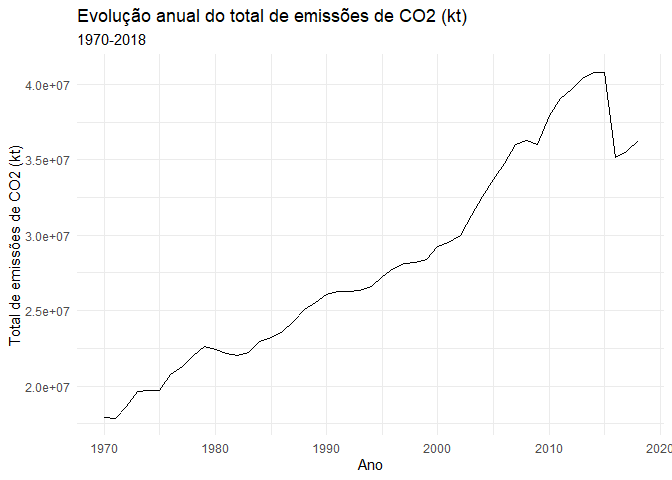<!-- -->

Evolução do total por região:

``` r
co2 %>%
  left_join(metadata, by = "ccode") %>%
  group_by(region, year) %>% #agrupa os dados por região
  summarise(co2_total = sum(co2, na.rm = TRUE)) %>%
  ungroup() %>%
  ggplot(aes(x = year, y = co2_total, color = region)) +
  geom_line() +
  theme_minimal() +
  labs(title = "Evolução do total das emissões de CO2 por região",
       subtitle = "1970-2018",
       x = "Ano",
       y = "Total de emissões de CO2 (kt)",
       color = "")
```

    ## `summarise()` has grouped output by 'region'. You can override using the
    ## `.groups` argument.

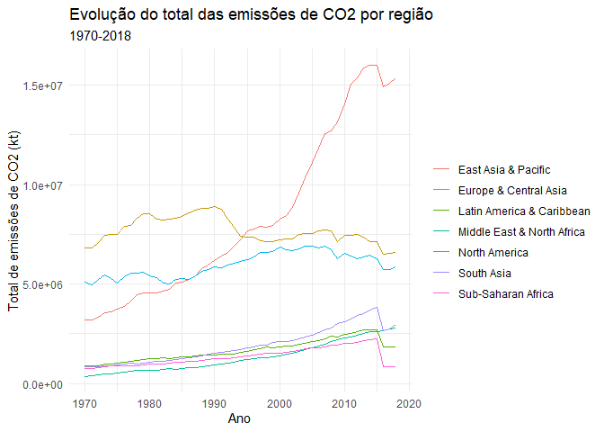<!-- -->

O padrão de queda a partir de 2016 se replica em todas as regiões. Ainda
assim, maior parte das regiões mostra tendencias de crescimento ao longo
dos anos; só a América do Norte, Europa e Ásia Central mostram uma
tendencia de queda; enquanto o Leste Asiático e o Pacífico apresentam
uma curva acentuada de crescimento das emissões.

Nota-se que esses gráficos estão sujeitos a distorções causadas por
dados ausentes. A média de emissões anuais, desconsiderando os valores
ausentes, pode fornecer um parâmetro mais confiável para inferir o
crescimento das emissões.

``` r
co2 %>%
  group_by(year) %>%
  summarise(co2_m = mean(co2, na.rm = TRUE)) %>%
  ggplot(aes(x = year, y = co2_m)) +
  geom_line() +
  theme_minimal() +
  labs(title = "Evolução anual da média de emissões de CO2 (kt)",
       subtitle = "1970-2018",
       x = "Ano",
       y = "Média das emissões de CO2 (kt)")
```

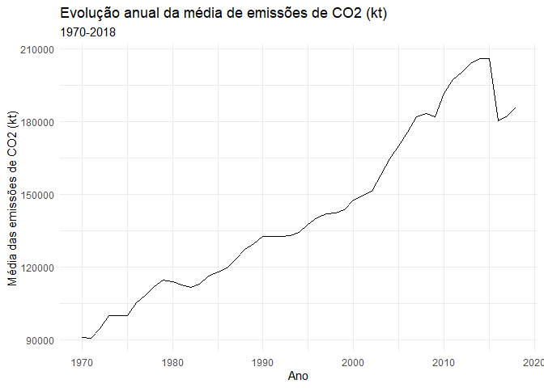<!-- -->

``` r
co2 %>%
  left_join(metadata, by = "ccode") %>%
  group_by(region, year) %>% 
  summarise(co2_m = mean(co2, na.rm = TRUE)) %>%
  ggplot(aes(x = year, y = co2_m, color = region)) +
  geom_line() +
  theme_minimal() +
  labs(title = "Evolução da média das emissões de CO2 por região",
       subtitle = "1970-2018",
       x = "Ano",
       y = "Média das emissões de CO2 (kt)",
       color = "")
```

    ## `summarise()` has grouped output by 'region'. You can override using the
    ## `.groups` argument.

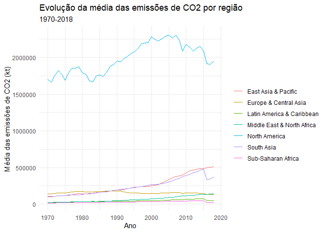<!-- -->

Os gráficos das médias indicam que realmente parece ter existido uma
redução brusca nas emissões de CO2 em 2016.

A queda das emissões em 2016 parece ter sido puxada sobretudo pelos EUA
e pela Índia:

``` r
# plota os países que tiveram a maior queda entre 2015 e 2016
filter(co2, year >= 2014) %>%
  spread(year, co2, sep = "_") %>%
  mutate(dif = year_2016 - year_2015) %>%
  arrange(desc(dif)) %>%
  drop_na(dif) %>%
  tail(5) %>%
  select(-dif) %>%
  gather(key = "year", value = "co2", -ccode, -country) %>%
  mutate(year = as.numeric(str_remove(year, "year_"))) %>%
  ggplot(aes(x = year, y = co2, color = country)) +
  geom_line() +
  theme_minimal() +
  labs(title = " Cinco países que mais reduziram suas emissões entre 2015 e 2016",
       x = "ano",
       color = "")
```

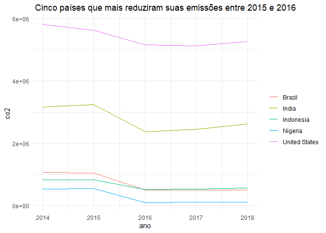<!-- -->

O código abaixo gera um gráfico setorial das emissões geradas por esses
países, em relação ao total gerado no período entre 2010-2018. Entre
2010 e 2018, China, EUA e Índia foram responsáveis por, aproximadamente,
metade das emissões de CO2 no mundo.

``` r
top_total_emissions <- co2 %>%
  filter(year >= 2010) %>%
  group_by(country) %>%
  summarise(co2_total = sum(co2, na.rm = TRUE)) %>%
  arrange(desc(co2_total)) %>%
  head(5)
co2 %>%
  mutate(country = if_else(country %in% top_total_emissions$country, country, "Other countries")) %>%
  filter(year >= 2010) %>%
  group_by(country) %>%
  summarize(co2 = sum(co2, na.rm = TRUE)) %>%
  mutate(country = fct_reorder(country, co2),
         co2_percent = co2 / sum(co2) * 100) %>%
  ggplot(aes(x = "", y = co2, fill = country)) +
  geom_bar(width = 1, stat = "identity") +
  geom_text(aes(label = sprintf("%.2f%%", co2_percent)), 
            position = position_stack(vjust = 0.5)) +
  theme_void() +
  labs(title = "Emissões geradas pelos países líderes no ranking no período (% relação ao total)",
       subtitle = "2010-2018",
       fill = "")
```

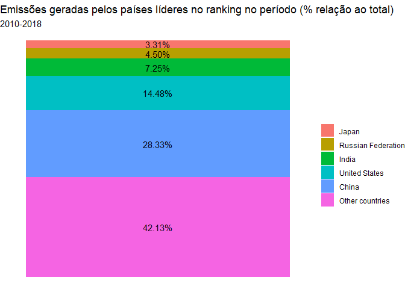<!-- -->

Já o próximo bloco mostra a evolução temporal das emissões desses
Estados:

``` r
ggplot(data = filter(co2, country %in% top_total_emissions$country),
       aes(x = year, y = co2, color = country)) +
  geom_line() +
  theme_minimal() +
  labs(title = "Evolução das emissões de CO2 dos 5 maiores emissores entre 2010 e 2018",
       x = "Ano",
       y = "Emissões de CO2 (kt)",
       color = "")
```

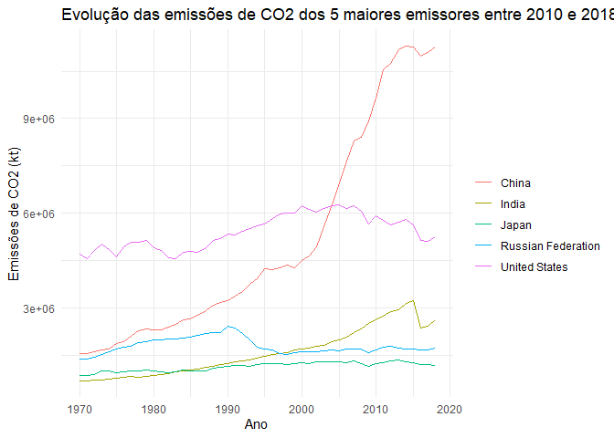<!-- -->

- EUA e Japão taxas estáveis no período;
- A Rússia tem taxas relativamente estáveis, com uma queda percepitível
  ao fim da URSS;
- China e Índia apresentam aumentos exponenciais a partir de meados da
  década de 90, com uma queda perceptível em 2016, seguida de aparente
  retomada no crescimento.

Outra forma de visualização interessante para esses dados é
confrontá-los com dados de georeferenciamento, disponíveis por meio do
pacote `maps`.

``` r
# calcula as médias para o período
co2_mean <- co2 %>%
  filter(year >= 2010) %>%
  group_by(country) %>% 
  summarise(co2_mean = mean(co2, na.rm = TRUE)) %>%
  drop_na()

# importa os dados geográficos do pacote `maps`
map <- map_data("world")
```

O banco `map`, contudo, precisa ser para garantir correspondência com os
dados das emissões de CO2. O código abaixo verifica a correspondência
entre os dados dos dois bancos, retornando uma lista com os países que
apresentarem problemas.

``` r
full_join(map, co2_mean, by = c("region" = "country")) %>%
  filter(is.na(group)) %>%
  pull(region)
```

    ##  [1] "Antigua and Barbuda"                       
    ##  [2] "Brunei Darussalam"                         
    ##  [3] "Congo"                                     
    ##  [4] "Congo_the Democratic Republic of the"      
    ##  [5] "Cote d'Ivoire"                             
    ##  [6] "Gibraltar"                                 
    ##  [7] "Hong Kong"                                 
    ##  [8] "Iran, Islamic Republic of"                 
    ##  [9] "Korea, Democratic People's Republic of"    
    ## [10] "Korea, Republic of"                        
    ## [11] "Lao People's Democratic Republic"          
    ## [12] "Libyan Arab Jamahiriya"                    
    ## [13] "Macao"                                     
    ## [14] "Macedonia, the former Yugoslav Republic of"
    ## [15] "Micronesia, Federated States of"           
    ## [16] "Moldova, Republic of"                      
    ## [17] "Russian Federation"                        
    ## [18] "Saint Kitts and Nevis"                     
    ## [19] "Saint Vincent and the Grenadines"          
    ## [20] "Syrian Arab Republic"                      
    ## [21] "Tanzania_United Republic of"               
    ## [22] "Trinidad and Tobago"                       
    ## [23] "United Kingdom"                            
    ## [24] "United States"                             
    ## [25] "Viet Nam"                                  
    ## [26] "Virgin Islands_British"

Essa padronização é feita a seguir, com o mapa sendo projetado ao final.

``` r
map <- map %>%
  # altera a grafia do nome dos países
  mutate(
    region = recode(region,
                    #não há dados para Gibraltar
                    "Brunei" = "Brunei Darussalam",
                    "Republic of Congo" = "Congo",
                    "Democratic Republic of the Congo" = "Congo_the Democratic Republic of the",
                    "Ivory Coast" = "Cote d'Ivoire",
                    "Iran" = "Iran, Islamic Republic of",
                    "North Korea" = "Korea, Democratic People's Republic of",
                    "South Korea" = "Korea, Republic of",
                    "Laos" = "Lao People's Democratic Republic",
                    "Libya" = "Libyan Arab Jamahiriya",
                    "North Macedonia" = "Macedonia, the former Yugoslav Republic of",
                    "Micronesia" = "Micronesia, Federated States of",
                    "Moldova" = "Moldova, Republic of",
                    "Russia" = "Russian Federation",
                    "Syria" = "Syrian Arab Republic",
                    "Tanzania" = "Tanzania_United Republic of",
                    "UK" = "United Kingdom",
                    "USA" = "United States",
                    "Vietnam" = "Viet Nam",
                    "Virgin Islands" = "Virgin Islands_British")) %>%
  # une Estados insulares com mais de uma ilha:
  mutate(
    region = recode(region,
                    "Antigua" = "Antigua and Barbuda",
                    "Barbuda" = "Antigua and Barbuda",
                    "Saint Kitts" = "Saint Kitts and Nevis",
                    "Nevis" = "Saint Kitts and Nevis",
                    "Saint Vincent" = "Saint Vincent and the Grenadines",
                    "Grenadines" = "Saint Vincent and the Grenadines",
                    "Trinidad" = "Trinidad and Tobago",
                    "Tobago" = "Trinidad and Tobago")) %>%
  # altera o nome dos territórios chinês de Hong Kong e Macao, com base na província
  mutate(
    region = case_when(
      subregion == "Hong Kong" ~ "Hong Kong",
      subregion == "Macao" ~ "Macao",
      TRUE ~ region
    )
  )

# define o banco co2_map, que será empregado na geração do mapa
co2_map <- left_join(map, co2_mean, by = c("region" = "country")) %>%
  group_by(region)
# Cria a escala de cores que será utilizada
color_scale <- scale_fill_gradient(low = "blue", high = "red")
# Cria o mapa
ggplot(co2_map) +
  geom_map(aes(map_id = region, fill = co2_mean), map = co2_map, color = "white") +
  expand_limits(x = co2_map$long, y = co2_map$lat) +
  color_scale +
  theme_void() +
  labs(title = "Médias de emissões anuais de CO2 (kt)",
       subtitle = "2010-2018",
       fill = "CO2 (kt)")
```

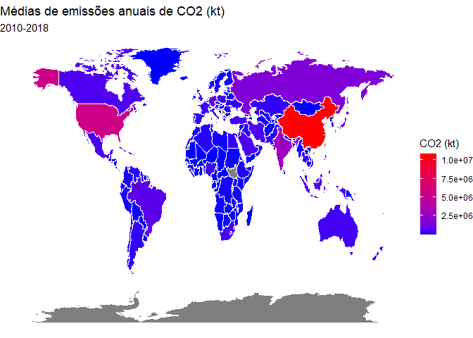<!-- -->

Por fim, têm-se a evolução temporal das principais métricas da emissão
de CO2.

``` r
co2_summary <- co2 %>%
  mutate(decade = as.numeric(paste0(substr(year, 1, 3), "0"))) %>%
  # cria a variável década, selecionando os três primeiros números do ano e adicionando um 0 ao final
  group_by(decade) %>% #agrupa os dados por década, em seguida calcula as métricas de interesse
  summarise(mean_co2 = mean(co2, na.rm = TRUE),
            median_co2 = median(co2, na.rm = TRUE),
            sd_co2 = sd(co2, na.rm = TRUE))
knitr::kable(co2_summary, col.names = c("Década", "CO2 - Média", "CO2 - Mediana", "CO2 - Desvio Padrão"))
```

| Década | CO2 - Média | CO2 - Mediana | CO2 - Desvio Padrão |
|-------:|------------:|--------------:|--------------------:|
|   1970 |    101637.0 |      10264.40 |            411919.8 |
|   1980 |    118554.6 |      12861.56 |            444175.9 |
|   1990 |    137090.6 |      15796.67 |            531137.9 |
|   2000 |    166406.3 |      19100.89 |            683735.3 |
|   2010 |    195010.1 |      19761.10 |            904366.3 |

A média e a mediana aumentaram a cada década, indicando um aumento geral
das emissões de CO2 no período. O desvio padrão também aumentou, o que
sugere um aumento na variabilidade das emissões entre os países.

### 5.2 População

Evolução da população mundial ao longo dos anos (1960-2021:

``` r
pop %>% 
  group_by(year) %>%
  summarise(pop_total = sum(pop, na.rm = TRUE)) %>%
  ggplot(aes(x = year, y = pop_total)) +
  geom_line() +
  theme_minimal() +
  labs(title = "Evolução da população mundial ao longo dos anos",
       subtitle = "1960-2021",
       x = "Ano",
       y = "População")
```

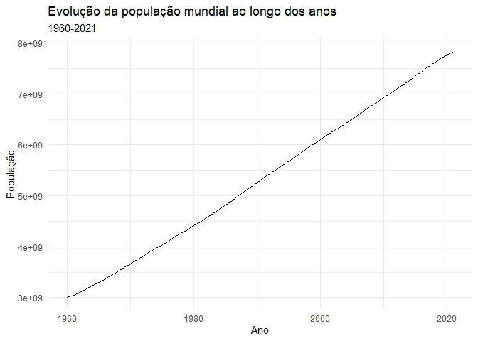<!-- -->

Evolução da população mundial, divida por regiões:

``` r
pop %>%
  left_join(metadata, by = "ccode") %>%
  group_by(region, year) %>% #agrupa os dados por região
  summarise(pop_total = sum(pop, na.rm = TRUE)) %>%
  ungroup() %>%
  ggplot(aes(x = year, y = pop_total, color = region)) +
  geom_line() +
  theme_minimal() +
  labs(title = "Evolução da população mundial, divida por regiões",
       subtitle = "1960-2021",
       x = "Ano",
       y = "População",
       color = "")
```

    ## `summarise()` has grouped output by 'region'. You can override using the
    ## `.groups` argument.

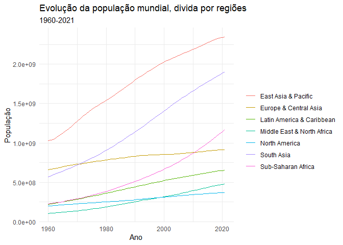<!-- -->

Embora as taxas de crescimento variem de região para região, em todos os
casos elas são estáveis e ascendentes.

``` r
# evolução temporal das principais métricas da população
pop_summary <- pop %>%
  mutate(decade = as.numeric(paste0(substr(year, 1, 3), "0"))) %>%
  # cria a variável década, selecionando os três primeiros números do ano e adicionando um 0 ao final
  group_by(decade) %>% #agrupa os dados por década, em seguida calcula as métricas de interesse
  summarise(mean_pop = mean(pop, na.rm = TRUE),
            median_pop = median(pop, na.rm = TRUE),
            sd_pop = sd(pop, na.rm = TRUE))
knitr::kable(pop_summary, col.names = c("Década", "Pop. - Média", "Pop. - Mediana", "Pop. - Desvio Padrão"))
```

| Década | Pop. - Média | Pop. - Mediana | Pop. - Desvio Padrão |
|-------:|-------------:|---------------:|---------------------:|
|   1960 |     16478671 |        3091414 |             64464801 |
|   1970 |     20106114 |        3845066 |             80317451 |
|   1980 |     24022872 |        4536151 |             95270798 |
|   1990 |     28354103 |        5179999 |            111853825 |
|   2000 |     32507862 |        6045834 |            126396631 |
|   2010 |     36735766 |        7289842 |            139069334 |
|   2020 |     39223899 |        8327306 |            145808789 |

A análise da evolução temporal das principais métricas da população
mundial revela que seu aumento significativo ao longo das décadas. O
desvio padrão também cresceu bastante, o que indica que a população
mundial está cada vez mais heterogênea. É importante lembrar que essas
medidas estão sujeitas a outliers e a variações que podem não ser
representativas da população mundial como um todo, mas dão uma ideia
geral de sua evolução.

O gráfico abaixo indica a força da correlação entre as taxas de emissão
de CO2 e a população.

``` r
# calcula as métricas
co2_pop <- inner_join(co2, pop, by = c("ccode", "country", "year"))
cor_co2_pop <- cor(co2_pop$co2, co2_pop$pop, use = "complete.obs")
r2_co2_pop <- cor_co2_pop^2
# plota o gráfico
ggplot(co2_pop, aes(x = co2, y = pop)) +
  geom_point(color = "grey") +
  scale_x_log10() +
  scale_y_log10() +
  theme_minimal() +
  geom_smooth(method="lm", col="darkred", linetype="dashed") +
  geom_text(x = Inf, y = Inf, label = paste0("R² = ", round(r2_co2_pop, 2)),
            hjust = 1, vjust = 1, size = 4, col="darkred") +
  labs(title = "Correlação entre população e emissões de CO2",
       subtitle = "1970-2018",
       x = "População (log)",
       y = "Emissões de CO2 (log)")
```

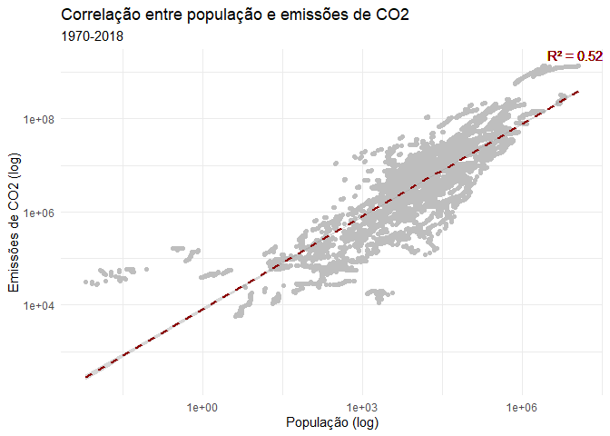<!-- -->

Uma correlação de 0,72 indica uma relação forte e positiva entre as duas
variáveis.Já o R² de 0,521 indica que 52,1% da variação nas emissões de
CO2 podem ser explicadas pela variação na população. Apesar da relação
não ser perfeita, ela é forte.

### 5.3 PIB

Evolução do PIB mundial ao longo dos anos:

``` r
pib %>% 
  group_by(year) %>%
  summarise(pib_total = sum(pib, na.rm = TRUE)) %>%
  ggplot(aes(x = year, y = pib_total)) +
  geom_line() +
  theme_minimal() +
  labs(title = "Evolução do PIB mundial ao longo dos anos",
       subtitle = "1960-2021",
       x = "Ano",
       y = "PIB")
```

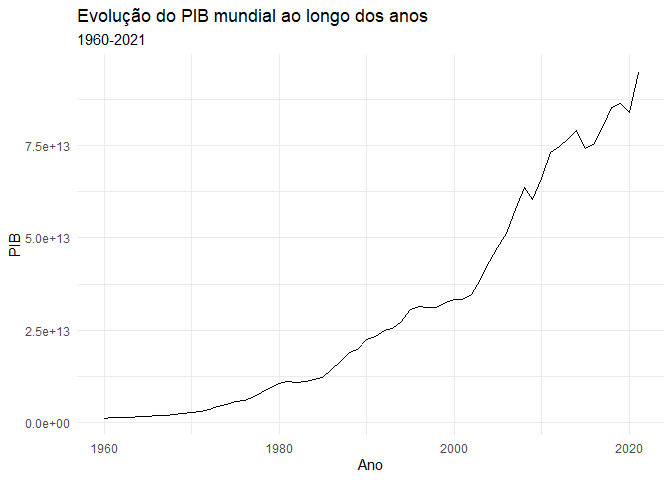<!-- -->

Evolução do PIB mundial, divido por regiões:

``` r
pib %>%
  left_join(metadata, by = "ccode") %>%
  group_by(region, year) %>% #agrupa os dados por região
  summarise(pib_total = sum(pib, na.rm = TRUE)) %>%
  ungroup() %>%
  ggplot(aes(x = year, y = pib_total, color = region)) +
  geom_line() +
  theme_minimal() +
  labs(title = "Evolução do PIB mundial, divido por regiões",
       subtitle = "1960-2021",
       x = "Ano",
       y = "PIB",
       color = "")
```

    ## `summarise()` has grouped output by 'region'. You can override using the
    ## `.groups` argument.

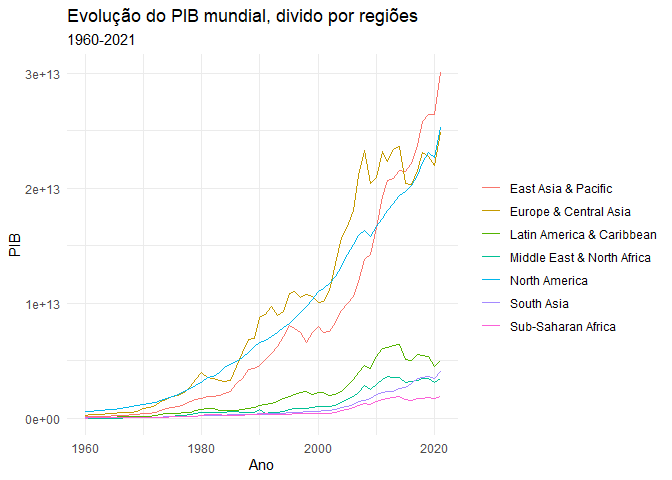<!-- -->

Embora o PIB apresente taxas de crescimento mais instáveis que a
população, em todos os casos ele ainda apresenta uma curva ascendente.

``` r
# evolução temporal das principais métricas de crescimento do PIB
pib_summary <- pib %>%
  mutate(decade = as.numeric(paste0(substr(year, 1, 3), "0"))) %>%
  group_by(decade) %>%
  summarise(mean_pib = mean(pib, na.rm = TRUE),
            median_pib = median(pib, na.rm = TRUE),
            sd_pib = sd(pib, na.rm = TRUE))
knitr::kable(pib_summary, col.names = c("Década", "PIB - Média", "PIB - Mediana", "PIB - Desvio Padrão"))
```

| Década |  PIB - Média | PIB - Mediana | PIB - Desvio Padrão |
|-------:|-------------:|--------------:|--------------------:|
|   1960 |  15171100522 |    1239358087 |        7.390083e+10 |
|   1970 |  42682126688 |    2855236212 |        1.773221e+11 |
|   1980 |  90897965492 |    5201818349 |        3.997737e+11 |
|   1990 | 156208850848 |    7123633418 |        6.986790e+11 |
|   2000 | 239903456748 |   12990158913 |        1.050166e+12 |
|   2010 | 397437337289 |   31317828584 |        1.611437e+12 |
|   2020 | 471832585650 |   34601740323 |        2.073843e+12 |

``` r
# calcula as métricas
co2_pib <- inner_join(co2, pib, by = c("ccode", "country", "year"))
cor_co2_pib <- cor(co2_pib$co2, co2_pib$pib, use = "complete.obs")
r2_co2_pib <- cor_co2_pib^2
# plota o gráfico
ggplot(co2_pib, aes(x = co2, y = pib)) +
  geom_point(color = "grey") +
  scale_x_log10() +
  scale_y_log10() +
  theme_minimal() +
  geom_smooth(method="lm", col="darkred", linetype="dashed") +
  geom_text(x = Inf, y = Inf, label = paste0("R² = ", round(r2_co2_pib, 2)),
            hjust = 1, vjust = 1, size = 4, col="darkred") +
  labs(title = "Correlação entre PIB e emissões de CO2",
       subtitle = "1970-2018",
       x = "PIB (log)",
       y = "Emissões de CO2 (log)")
```

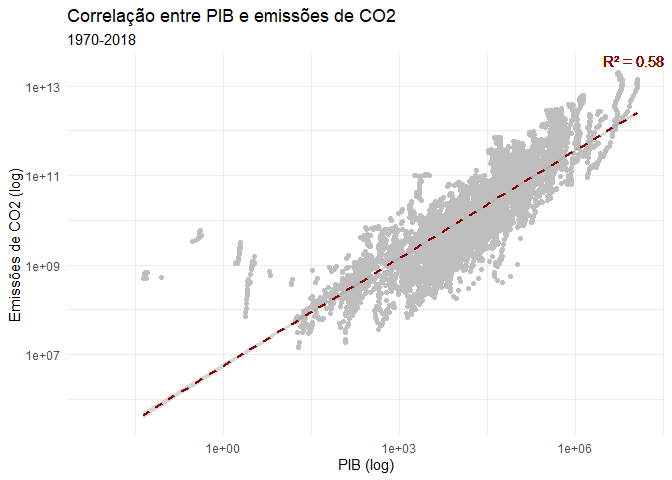<!-- -->

De modo semelhante ao notado na população, a correlação de 0,76 indica
uma relação forte e positiva entre as duas variáveis. Já o R² de 0,579
indica que 57,9% da variação nas emissões de CO2 podem ser explicadas
pela variação no PIB. Novamente, apesar da relação não ser perfeita, ela
é forte.

``` r
# calcula as métricas
pop_pib <- inner_join(pop, pib, by = c("ccode", "country", "year"))
cor_pop_pib <- cor(pop_pib$pop, pop_pib$pib, use = "complete.obs")
r2_pop_pib <- cor_pop_pib^2
# plota o gráfico
ggplot(pop_pib, aes(x = pop, y = pib)) +
  geom_point(color = "grey") +
  scale_x_log10() +
  scale_y_log10() +
  theme_minimal() +
  geom_smooth(method="lm", col="darkred", linetype="dashed") +
  geom_text(x = Inf, y = Inf, label = paste0("R² = ", round(r2_pop_pib, 2)),
            hjust = 1, vjust = 1, size = 4, col="darkred") +
  labs(title = "Correlação entre a população e o tamanho do PIB",
       subtitle = "1970-2018",
       x = "PIB (log)",
       y = "População (log)")
```

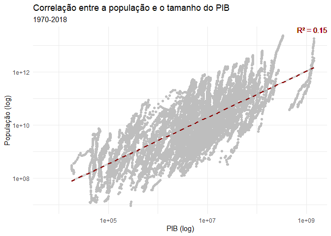<!-- -->

Por outro lado, a correlação de 0,38 e o R² de 0,146 entre população e
PIB apontam uma relação menos significativa entre as duas variáveis.
Isso sugere que elas podem estar contribuindo com informações
complementares sobre as emissões de CO2.

## 6. CONSTRUÇÃO DOS MODELOS DE PREVISÃO PARA AS EMISSÕES DE CO2 FUTURAS

Serão testados os seguintes modelos: - Modelo de regressão linear
simples (RLS); - Modelo de regressão linear múltipla (RLM); - Modelo
aditivo generalizado (GAM); - Modelo auto-regressivo integrado de médias
móveis (ARIMA); e - Modelo auto-regressivo integrado de médias móveis
com entradas de variáveis exógenas (ARIMAX).

O bloco abaixo separa os dados em conjuntos de treino (1970-2015) e
teste (2016-2018).

``` r
dados_treino <- dados %>% filter(year <= 2015)
dados_teste <- dados %>% filter(year > 2015)
```

### 6.1 Modelo de regressão linear simples

Constrói o modelo:

``` r
modelo_lms <- lm(co2 ~ year, data = dados_treino)
summary(modelo_lms)
```

    ## 
    ## Call:
    ## lm(formula = co2 ~ year, data = dados_treino)
    ## 
    ## Residuals:
    ##      Min       1Q   Median       3Q      Max 
    ##  -214290  -167203  -135057   -93525 11070175 
    ## 
    ## Coefficients:
    ##               Estimate Std. Error t value Pr(>|t|)    
    ## (Intercept) -4346572.7  1277156.6  -3.403 0.000670 ***
    ## year            2263.5      640.4   3.535 0.000411 ***
    ## ---
    ## Signif. codes:  0 '***' 0.001 '**' 0.01 '*' 0.05 '.' 0.1 ' ' 1
    ## 
    ## Residual standard error: 679500 on 6662 degrees of freedom
    ## Multiple R-squared:  0.001872,   Adjusted R-squared:  0.001722 
    ## F-statistic: 12.49 on 1 and 6662 DF,  p-value: 0.0004113

Estabelece previsões e estima métricas para análise:

``` r
# Previsões com o modelo de regressão linear simples
previsoes_lms <- predict(modelo_lms, newdata = dados_teste)
# Para avaliar o modelo, se usa os dados de teste para calcular a Raiz do Erro Médio Quadrático (RMSE),
rmse_lms <- sqrt(mean((previsoes_lms - dados_teste$co2)^2))
# o Erro Absoluto Médio (MAE),
mae_lms <- mean(abs(previsoes_lms - dados_teste$co2))
# o Critério de Informação de Akaike (AIC),
aic_lms <- AIC(modelo_lms)
# e o Critério de Informação Bayesiano (BIC)
bic_lms <- BIC(modelo_lms)
```

### 6.2 Modelo de regressão linear múltipla

Constrói o modelo:

``` r
modelo_lm <- lm(co2 ~ pop + pib, data = dados_treino)
summary(modelo_lm)
```

    ## 
    ## Call:
    ## lm(formula = co2 ~ pop + pib, data = dados_treino)
    ## 
    ## Residuals:
    ##      Min       1Q   Median       3Q      Max 
    ## -2949155   -11783     4089     8092  3839053 
    ## 
    ## Coefficients:
    ##               Estimate Std. Error t value Pr(>|t|)    
    ## (Intercept) -7.607e+03  3.802e+03  -2.001   0.0455 *  
    ## pop          2.753e-03  3.041e-05  90.521   <2e-16 ***
    ## pib          4.228e-07  4.126e-09 102.487   <2e-16 ***
    ## ---
    ## Signif. codes:  0 '***' 0.001 '**' 0.01 '*' 0.05 '.' 0.1 ' ' 1
    ## 
    ## Residual standard error: 297900 on 6661 degrees of freedom
    ## Multiple R-squared:  0.8082, Adjusted R-squared:  0.8081 
    ## F-statistic: 1.403e+04 on 2 and 6661 DF,  p-value: < 2.2e-16

Estabelece previsões e estima métricas para análise:

``` r
# Previsões com o modelo de regressão linear múltipla
previsoes_lm <- predict(modelo_lm, newdata = dados_teste)
# Avaliação do modelo
rmse_lm <- sqrt(mean((previsoes_lm - dados_teste$co2)^2))
mae_lm <- mean(abs(previsoes_lm - dados_teste$co2))
aic_lm <- AIC(modelo_lm)
bic_lm <- BIC(modelo_lm)
```

### 6.3 Modelo GAM

Embora a relação entre as variáveis pareça ser linear, vale a pena
testar o modelo GAM.

Constrói variações do modelo GAM:

``` r
modelo_gam1 <- gam(co2 ~ s(pop) + pib, data = dados_treino) # supõe co2~pop como relação não-linear 
summary(modelo_gam1)
```

    ## 
    ## Family: gaussian 
    ## Link function: identity 
    ## 
    ## Formula:
    ## co2 ~ s(pop) + pib
    ## 
    ## Parametric coefficients:
    ##              Estimate Std. Error t value Pr(>|t|)    
    ## (Intercept) 1.199e-19  1.225e-21   97.86   <2e-16 ***
    ## pib         5.607e-07  5.729e-09   97.86   <2e-16 ***
    ## ---
    ## Signif. codes:  0 '***' 0.001 '**' 0.01 '*' 0.05 '.' 0.1 ' ' 1
    ## 
    ## Approximate significance of smooth terms:
    ##              edf    Ref.df         F p-value    
    ## s(pop) 1.778e-25 1.778e-25 5.387e+28  <2e-16 ***
    ## ---
    ## Signif. codes:  0 '***' 0.001 '**' 0.01 '*' 0.05 '.' 0.1 ' ' 1
    ## 
    ## Rank: 1/11
    ## R-sq.(adj) =  0.572   Deviance explained = 56.5%
    ## GCV = 2.0133e+11  Scale est. = 2.013e+11  n = 6664

``` r
modelo_gam2 <- gam(co2 ~ pop + s(pib), data = dados_treino) # supõe co2~pib como relação não-linear 
summary(modelo_gam2)
```

    ## 
    ## Family: gaussian 
    ## Link function: identity 
    ## 
    ## Formula:
    ## co2 ~ pop + s(pib)
    ## 
    ## Parametric coefficients:
    ##              Estimate Std. Error t value Pr(>|t|)    
    ## (Intercept) 7.462e-12  8.595e-14   86.81   <2e-16 ***
    ## pop         3.876e-03  4.464e-05   86.81   <2e-16 ***
    ## ---
    ## Signif. codes:  0 '***' 0.001 '**' 0.01 '*' 0.05 '.' 0.1 ' ' 1
    ## 
    ## Approximate significance of smooth terms:
    ##              edf    Ref.df        F p-value    
    ## s(pib) 6.443e-18 6.443e-18 1.17e+21  <2e-16 ***
    ## ---
    ## Signif. codes:  0 '***' 0.001 '**' 0.01 '*' 0.05 '.' 0.1 ' ' 1
    ## 
    ## Rank: 1/11
    ## R-sq.(adj) =  0.505   Deviance explained = 50.2%
    ## GCV = 2.3025e+11  Scale est. = 2.3021e+11  n = 6664

``` r
modelo_gam3 <- gam(co2 ~ s(pop) + pib, data = dados_treino) # supõe co2~pop e co2~pib como não-linear 
summary(modelo_gam3)
```

    ## 
    ## Family: gaussian 
    ## Link function: identity 
    ## 
    ## Formula:
    ## co2 ~ s(pop) + pib
    ## 
    ## Parametric coefficients:
    ##              Estimate Std. Error t value Pr(>|t|)    
    ## (Intercept) 1.199e-19  1.225e-21   97.86   <2e-16 ***
    ## pib         5.607e-07  5.729e-09   97.86   <2e-16 ***
    ## ---
    ## Signif. codes:  0 '***' 0.001 '**' 0.01 '*' 0.05 '.' 0.1 ' ' 1
    ## 
    ## Approximate significance of smooth terms:
    ##              edf    Ref.df         F p-value    
    ## s(pop) 1.778e-25 1.778e-25 5.387e+28  <2e-16 ***
    ## ---
    ## Signif. codes:  0 '***' 0.001 '**' 0.01 '*' 0.05 '.' 0.1 ' ' 1
    ## 
    ## Rank: 1/11
    ## R-sq.(adj) =  0.572   Deviance explained = 56.5%
    ## GCV = 2.0133e+11  Scale est. = 2.013e+11  n = 6664

Estabelece previsões e estima métricas para análise:

``` r
# Previsões com os modelos GAM
previsoes_gam1 <- predict(modelo_gam1, newdata = dados_teste)
previsoes_gam2 <- predict(modelo_gam2, newdata = dados_teste)
previsoes_gam3 <- predict(modelo_gam3, newdata = dados_teste)

# Avaliação dos modelos GAM
rmse_gam1 <- sqrt(mean((previsoes_lm - dados_teste$co2)^2))
rmse_gam2 <- sqrt(mean((previsoes_lm - dados_teste$co2)^2))
rmse_gam3 <- sqrt(mean((previsoes_lm - dados_teste$co2)^2))

mae_gam1 <- mean(abs(previsoes_gam1 - dados_teste$co2))
mae_gam2 <- mean(abs(previsoes_gam2 - dados_teste$co2))
mae_gam3 <- mean(abs(previsoes_gam3 - dados_teste$co2))

aic_gam1 <- AIC(modelo_gam1)
aic_gam2 <- AIC(modelo_gam2)
aic_gam3 <- AIC(modelo_gam3)

bic_gam1 <- BIC(modelo_gam1)
bic_gam2 <- BIC(modelo_gam2)
bic_gam3 <- BIC(modelo_gam3)
```

### 6.4 Modelo ARIMA

Constrói o modelo:

``` r
modelo_arima <- auto.arima(dados_treino$co2)
summary(modelo_arima)
```

    ## Series: dados_treino$co2 
    ## ARIMA(5,1,0) 
    ## 
    ## Coefficients:
    ##           ar1      ar2      ar3      ar4      ar5
    ##       -0.8342  -0.6568  -0.4651  -0.3062  -0.1565
    ## s.e.   0.0121   0.0154   0.0164   0.0154   0.0121
    ## 
    ## sigma^2 = 5.508e+11:  log likelihood = -99518.41
    ## AIC=199048.8   AICc=199048.8   BIC=199089.6
    ## 
    ## Training set error measures:
    ##                    ME     RMSE      MAE       MPE     MAPE      MASE
    ## Training set 43.08413 741840.2 269280.3 -429485.8 429518.5 0.8968361
    ##                     ACF1
    ## Training set -0.02181871

Estabelece previsões e estima métricas para análise:

``` r
previsoes_arima <- forecast(modelo_arima, h = nrow(dados_teste))$mean
# a função forecast retorna uma lista com múltiplas informações
# o item mean é onde consta as previsões

# Avaliação do modelo
rmse_arima <- sqrt(mean((previsoes_arima - dados_teste$co2)^2))
mae_arima <- mean(abs(previsoes_arima - dados_teste$co2))
aic_arima <- AIC(modelo_arima)
bic_arima <- BIC(modelo_arima)
```

### 6.5 Modelo ARIMAX

Constrói o modelo:

``` r
modelo_arimax <- auto.arima(dados_treino$co2,
                            xreg = as.matrix(dados_treino[, c("pop", "pib")]))
summary(modelo_arimax)
```

    ## Series: dados_treino$co2 
    ## Regression with ARIMA(5,1,0) errors 
    ## 
    ## Coefficients:
    ##           ar1      ar2      ar3      ar4      ar5    drift     pop  pib
    ##       -0.8322  -0.6679  -0.4834  -0.3351  -0.1529  47.9557  0.0028    0
    ## s.e.   0.0121   0.0153   0.0163   0.0153   0.0121   0.3697  0.0000    0
    ## 
    ## sigma^2 = 1.017e+11:  log likelihood = -93887.85
    ## AIC=187793.7   AICc=187793.7   BIC=187854.9
    ## 
    ## Training set error measures:
    ##                     ME     RMSE      MAE      MPE     MAPE      MASE
    ## Training set -147.8083 318646.7 128198.6 129106.1 148830.1 0.4269645
    ##                     ACF1
    ## Training set -0.02224269

Estabelece previsões e estima métricas para análise:

``` r
# Previsões com o modelo ARIMA
previsoes_arimax <- forecast(modelo_arimax, h = nrow(dados_teste), 
                             xreg = as.matrix(dados_treino[, c("pop", "pib")]))$mean
# Avaliação do modelo
rmse_arimax <- sqrt(mean((previsoes_arimax - dados_teste$co2)^2))
mae_arimax <- mean(abs(previsoes_arimax - dados_teste$co2))
aic_arimax <- AIC(modelo_arimax)
bic_arimax <- BIC(modelo_arimax)
```

## 7. AVALIAÇÃO DOS MODELOS

cria um dataframe com os resultados dos testes de avaliação aplicados em
cada modelo:

``` r
resultados <- data.frame()
# preenche as linhas do dataframe com os valores calculados para cada modelo
resultados <- rbind(resultados, c("RLS", rmse_lms, mae_lms, AIC(modelo_lms), BIC(modelo_lms)))
resultados <- rbind(resultados, c("RLM", rmse_lm, mae_lm, AIC(modelo_lm), BIC(modelo_lm)))
resultados <- rbind(resultados, c("GAM_1", rmse_gam1, mae_gam1, AIC(modelo_gam1), BIC(modelo_gam1)))
resultados <- rbind(resultados, c("GAM_2", rmse_gam2, mae_gam2, AIC(modelo_gam2), BIC(modelo_gam2)))
resultados <- rbind(resultados, c("GAM_3", rmse_gam3, mae_gam3, AIC(modelo_gam3), BIC(modelo_gam3)))
resultados <- rbind(resultados, c("ARIMA", rmse_arima, mae_arima, AIC(modelo_arima), BIC(modelo_arima)))
resultados <- rbind(resultados, c("ARIMAX", rmse_arimax, mae_arimax, AIC(modelo_arimax), BIC(modelo_arimax)))
# renomeia as colunas e exibe o dataframe com os resultados
knitr::kable(resultados, col.names = c("Modelo", "RMSE", "MAE", "AIC", "BIC"))
```

| Modelo | RMSE             | MAE              | AIC              | BIC              |
|:-------|:-----------------|:-----------------|:-----------------|:-----------------|
| RLS    | 978570.90319177  | 310077.237780058 | 197899.562067641 | 197919.975493192 |
| RLM    | 452709.970944825 | 148620.547243061 | 186910.905202799 | 186938.123103534 |
| GAM_1  | 452709.970944825 | 149421.425837183 | 192365.707281727 | 192379.316232094 |
| GAM_2  | 452709.970944825 | 150247.431421962 | 193260.024500025 | 193273.633450393 |
| GAM_3  | 452709.970944825 | 149421.425837183 | 192365.707281727 | 192379.316232094 |
| ARIMA  | 980844.687763667 | 249199.298608465 | 199048.818113128 | 199089.644063803 |
| ARIMAX | 1187227.35857804 | 457691.921438595 | 187793.701862828 | 187854.940788841 |

``` r
cores <- c("blue", "green", "red", "purple", "orange", "yellow", "brown")

# Comparação entre os modelo - RMSE
rmse <- c(rmse_lms,
          rmse_lm,
          rmse_gam1,
          rmse_gam2,
          rmse_gam3,
          rmse_arima,
          rmse_arimax)
modelos <- c("RLS", "RLM", "GAM_1", "GAM_2", "GAM_3", "ARIMA", "ARIMAX")
barplot(rmse, names.arg = modelos, col = cores,
        main = "Comparação entre os modelos - Raiz do Erro Médio Quadrático (RMSE)",
        xlab = "Modelo", ylab = "RMSE")
```

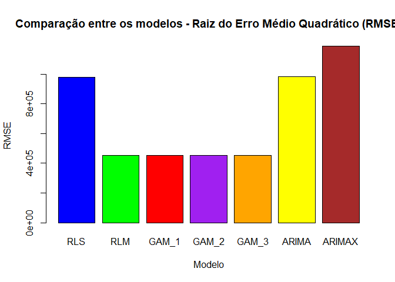<!-- -->

``` r
# Comparação entre os modelo - MAE
mae <- c(mae_lms,
         mae_lm,
         mae_gam1,
         mae_gam2,
         mae_gam3,
         mae_arima,
         mae_arimax)
modelos <- c("RLS", "RLM", "GAM_1", "GAM_2", "GAM_3", "ARIMA", "ARIMAX")
barplot(mae, names.arg = modelos, col = cores,
        main = "Comparação entre os modelos - Erro Absoluto Médio (MAE)",
        xlab = "Modelo", ylab = "MAE")
```

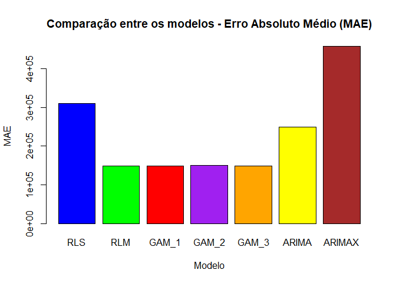<!-- -->

``` r
# Comparação entre os modelo - AIC
aic <- c(aic_lms,
         aic_lm,
         aic_gam1,
         aic_gam2,
         aic_gam3,
         aic_arima,
         aic_arimax)
modelos <- c("RLS", "RLM", "GAM_1", "GAM_2", "GAM_3", "ARIMA", "ARIMAX")
barplot(aic, names.arg = modelos, col = cores,
        main = "Comparação entre os modelos - Critério de Informação de Akaike (AIC)",
        xlab = "Modelo", ylab = "AIC")
```

<!-- -->

``` r
# Comparação entre os modelo - BIC
bic <- c(bic_lms,
         bic_lm,
         bic_gam1,
         bic_gam2,
         bic_gam3,
         bic_arima,
         bic_arimax)
modelos <- c("RLS", "RLM", "GAM_1", "GAM_2", "GAM_3", "ARIMA", "ARIMAX")
barplot(bic, names.arg = modelos, col = cores,
        main = "Comparação entre os modelos - Critério de Informação Bayesiano (BIC)",
        xlab = "Modelo", ylab = "BIC")
```

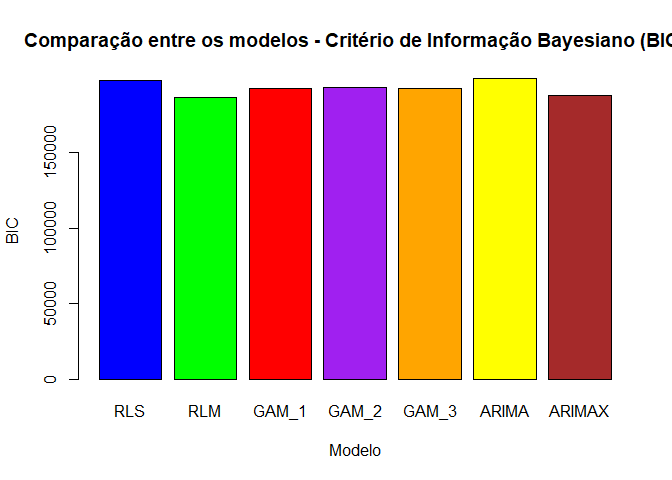<!-- -->

## 8. CONCLUSÕES

- O RLS apresentou RMSE elevado, indicando baixa acurácia na previsão
  das emissões de CO2.

- O RLM Apresentou menor RMSE e MAE em relação ao RLS, sugerindo que a
  inclusão das variáveis explicativas pib e pop melhorou o modelo.

- Os três modelos GAM testados apresentaram desempenho semelhante ao
  RLM, indicando que o modelo linear múltiplo já é suficiente.

- O ARIMA apresentou RMSE elevado, sugerindo baixa acurácia na previsão
  das emissões de CO2.

- O ARIMAX Apresentou o maior RMSE e MAE entre todos os modelos,
  indicando que a inclusão de pib e pop não melhorou a previsão em
  relação ao modelo ARIMA simples.

**Conclui-se que, entre os modelos testados, o que apresentou os
melhores resultados foi o modelo de regressão linear múltipla.**
